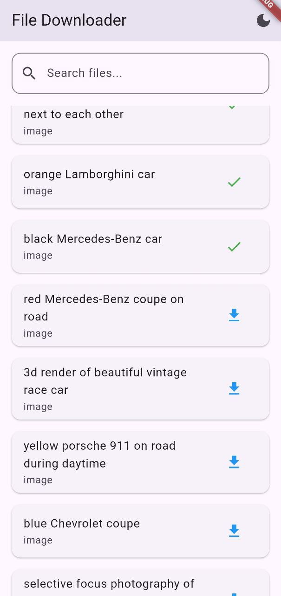
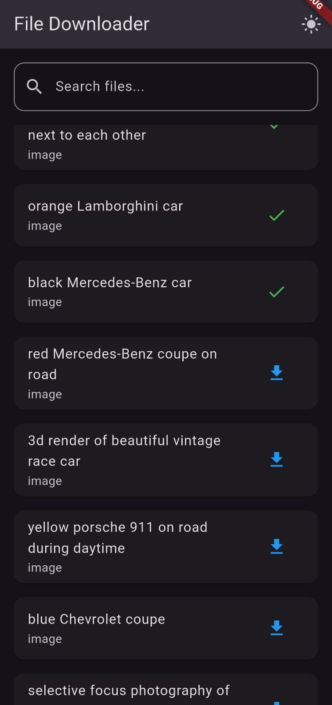

# Flutter File Downloader App

A modern Flutter application that allows users to download and manage files using RapidAPI integration. Built with clean architecture principles and modern Flutter development practices.

## 🌟 Features

- **File Browsing**: Browse and search through files from RapidAPI
- **Download Management**: Download files with progress tracking
- **Local Storage**: Save and manage downloaded files using Hive
- **Theme Support**: Toggle between light and dark themes
- **Clean Architecture**: Organized codebase following clean architecture principles
- **BLoC Pattern**: Efficient state management using BLoC
- **Responsive UI**: Beautiful and responsive design that works on both Android and iOS

## 🏗️ Architecture

The project follows Clean Architecture principles with the following layers:

## Getting Started
```
lib/
├── core/
│ ├── service/
│ ├── theme/
│ └── keys/
├── data/
│ ├── datasources/
│ ├── models/
│ └── repositories/
├── domain/
│ ├── entities/
├── presentation/
| ├─bloc/
│ ├── pages/
│ └── widgets/
└── main.dart
```

## 🛠️ Technologies Used

- **State Management**: flutter_bloc (^9.0.0)
- **Local Storage**: Hive (^2.2.3)
- **API Integration**: http (^1.3.0)
- **File Download**: flutter_downloader (^1.12.0)
- **Image Caching**: cached_network_image (^3.3.1)
- **Permissions**: permission_handler (^11.4.0)

## 📱 Screenshots


## 🚀 Getting Started

### Prerequisites

- Flutter SDK (^3.6.0)
- Dart SDK (^3.6.0)
- RapidAPI Key

### Installation

1. Clone the repository:
```bash
git clone [your-repository-url]
```

2. Install dependencies:
```bash
flutter pub get
```

3. Generate Hive adapters:
```bash
flutter pub run build_runner build
```

4. Add your RapidAPI key in `env.json`:
```json
rapidapiKey = 'your_api_key_here';
```

5. Run the app:
```bash
flutter run
```


## 📝 Project Structure

### Core Features

1. **API Integration**
   - RapidAPI client for fetching files
   - Error handling and response mapping

2. **File Management**
   - Download functionality using flutter_downloader
   - Progress tracking and notifications
   - Local storage management with Hive

3. **State Management**
   - BLoC pattern implementation
   - Event-driven architecture
   - Separation of concerns

4. **UI Components**
   - Custom widgets for file items
   - Progress indicators
   - Search functionality
   - Theme switching

## 🔐 Permissions

### Android
- Internet access
- Storage read/write
- Media access
- Notifications

### iOS
- Photo library access
- Background fetch
- File sharing
- Network access

## 📚 Dependencies

Key dependencies used in this project:

```yaml
dependencies:
  flutter_bloc: ^9.0.0
  hive: ^2.2.3
  hive_flutter: ^1.1.0
  http: ^1.3.0
  flutter_downloader: ^1.12.0
  cached_network_image: ^3.3.1
  permission_handler: ^11.4.0
```

## 🤝 Contributing

1. Fork the Project
2. Create your Feature Branch (`git checkout -b feature/AmazingFeature`)
3. Commit your Changes (`git commit -m 'Add some AmazingFeature'`)
4. Push to the Branch (`git push origin feature/AmazingFeature`)
5. Open a Pull Request


## 📞 Contact

For any queries or suggestions, please reach out to:
[dhruvkabariya1@gmail.com]

## Screenshots

### Light Theme


### Dark Theme


## Video Tutorial

Click the image below to watch the tutorial on YouTube:

[](https://www.youtube.com/shorts/0rP--2nr-ic)
